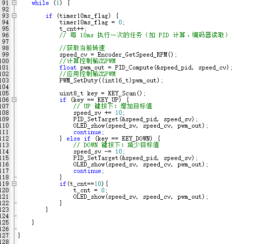
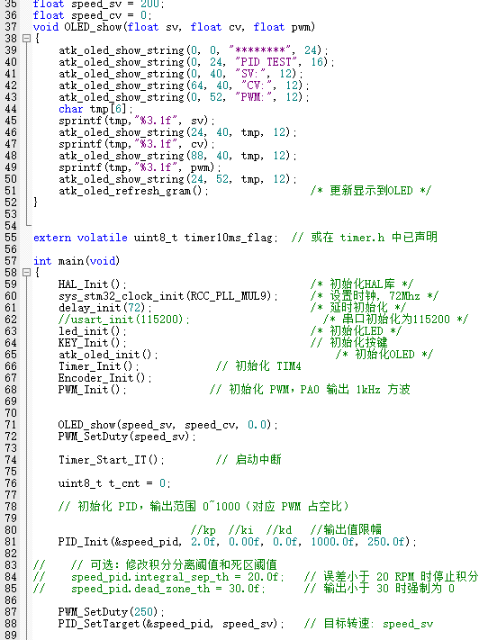

  

# 项目名称：基于stm32的直流伺服电机转速控制

> 关键词：`Simulink` `PID控制` `L298N直流电机驱动` `定时器编码器模式` `PWM输出模式`

---

## 1. 项目目的
- 1）、理解微型计算机反馈控制的基本原理；
- 2）、掌握STM32单片机定时器的使用；
- 3）、掌握STM32单片机的定时器编码器模式与PWM输出模式的使用；
- 4）、掌握STM32下的L298N直流电机驱动模块的使用；
- 5）、掌握数字PID控制率的编程实现，熟悉数字PID控制率的参数经验整定。

---

## 2. 项目设备
- **硬件平台**：PC机，带编码器的直流电机对象，STM32开发板，L298N直流电机驱动模块
- **软件框架**：Keil集成开发环境，matlab

---

## 3. 我负责的核心工作
- **技术算法实现**：基于STM32单片机与LS298N直流电机驱动模块实现对带编码器直流电机对象的数字PID控制，使其转速能恒定在可调的设定值上，并通过试凑法调出优化的PID参数。
- **调试**：配置MCU，烧录程序,编写I2C驱动读取霍尔传感器数据
- **功能设计**：按键控制转速, PID试凑法调参

---

## 4. 主要实现模块

---
